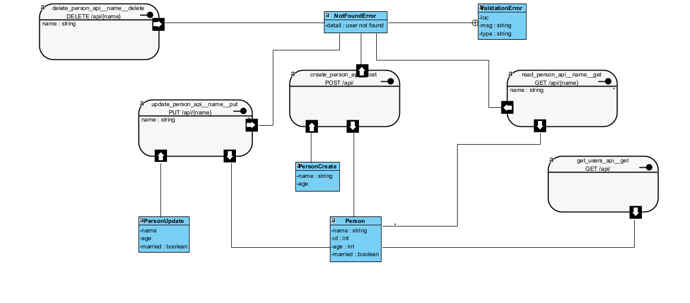

# FastAPI SQLite CRUD API Documentation 🚀

Welcome to the FastAPI SQLite CRUD API Documentation! 📚 Here, we'll guide you through all the nifty details about our API, from standard request/response formats to setup instructions. Let's dive right in! 🏊‍♂️

## Table of Contents 📖

- [FastAPI SQLite CRUD API Documentation 🚀](#fastapi-sqlite-crud-api-documentation-)
  - [Table of Contents 📖](#table-of-contents-)
  - [Application UML](#application-uml)
  - [Standard Formats 📋](#standard-formats-)
    - [Create Person Request Format 🧑‍🦱](#create-person-request-format-)
    - [Create Person Response Format 🌟](#create-person-response-format-)
    - [Get Person by Name Response Format 👓](#get-person-by-name-response-format-)
    - [Update Person Request Format 🔄](#update-person-request-format-)
    - [Update Person Response Format 🎉](#update-person-response-format-)
    - [Delete Person Response Format 🗑️](#delete-person-response-format-️)
  - [Sample Usage 🚀](#sample-usage-)
    - [Create Person ✨](#create-person-)
    - [Get Person by Name 👀](#get-person-by-name-)
    - [Update Person 🔄](#update-person-)
    - [Delete Person 🗑️](#delete-person-️)
  - [Known Limitations and Assumptions 🤷‍♂️](#known-limitations-and-assumptions-️)
  - [Testing the API 🧪](#testing-the-api-)
  - [Setup Instructions 🛠️](#setup-instructions-️)
    - [Local Deployment 🏠](#local-deployment-)

---
## Application UML

This UML diagram illustrates the structure and relationships of the API's classes and models.


## Standard Formats 📋

### Create Person Request Format 🧑‍🦱

```json
{
  "name": "John Doe",
  "age": 30,
  "married": true
}
```

**Note**: The `age` and `married` fields are optional. If not provided, default values will be used. 😄

### Create Person Response Format 🌟

```json
{
  "id": 1,
  "name": "John Doe",
  "age": 30,
  "married": true
}
```

### Get Person by Name Response Format 👓

```json
{
  "id": 1,
  "name": "John Doe",
  "age": 30,
  "married": true
}
```

### Update Person Request Format 🔄

```json
{
  "name": "New Name",
  "age": 35
}
```

**Note**: The `name` and `age` fields are optional. Provide the fields you want to update. 🛠️

### Update Person Response Format 🎉

```json
{
  "id": 1,
  "name": "New Name",
  "age": 35,
  "married": true
}
```

### Delete Person Response Format 🗑️

```json
{
  "message": "User successfully deleted"
}
```

---

## Sample Usage 🚀

### Create Person ✨

```bash
curl -X POST http://localhost:8000/api/ -H "Content-Type: application/json" -d '{
  "name": "John Doe"
}'
```

**Response**:

```json
{
  "id": 1,
  "name": "John Doe",
  "age": null,
  "married": false
}
```

### Get Person by Name 👀

```bash
curl http://localhost:8000/api/John%20Doe
```

**Response**:

```json
{
  "id": 1,
  "name": "John Doe",
  "age": null,
  "married": false
}
```

### Update Person 🔄

```bash
curl -X PUT http://localhost:8000/api/John%20Doe -H "Content-Type: application/json" -d '{
  "name": "Updated Name"
}'
```

**Response**:

```json
{
  "id": 1,
  "name": "Updated Name",
  "age": null,
  "married": false
}
```

### Delete Person 🗑️

```bash
curl -X DELETE http://localhost:8000/api/John%20Doe
```

**Response**:

```json
{
  "message": "User successfully deleted"
}
```


---

## Known Limitations and Assumptions 🤷‍♂️

- Age and marital status are optional fields. If not provided during person creation or update, default values (age: null, married: false) will be used. 😅

---

## Testing the API 🧪

To test the API and explore its capabilities, you can access it  [here](/[docs](https://hng-task-2-k7ad.onrender.com)) provided by our API. This interactive documentation allows you to send requests, view responses, and get a hands-on experience with our API endpoints. Enjoy exploring! 🙌😊

## Setup Instructions 🛠️

### Local Deployment 🏠

Follow these steps to deploy the API locally:

1. Clone the GitHub repository:

   ```bash
   git clone https://github.com/IgweDaniel/HNG_TASK-2.git
   ```

2. Change to the project directory:

   ```bash
   cd HNG_TASK-2
   ```

3. Install the required Python dependencies using Poetry:

   ```bash
   poetry install
   ```

4. Start the FastAPI server:

   ```bash
   poetry run uvicorn main:app --reload
   ```

   The API will be accessible at `http://localhost:8000`. 🌐


